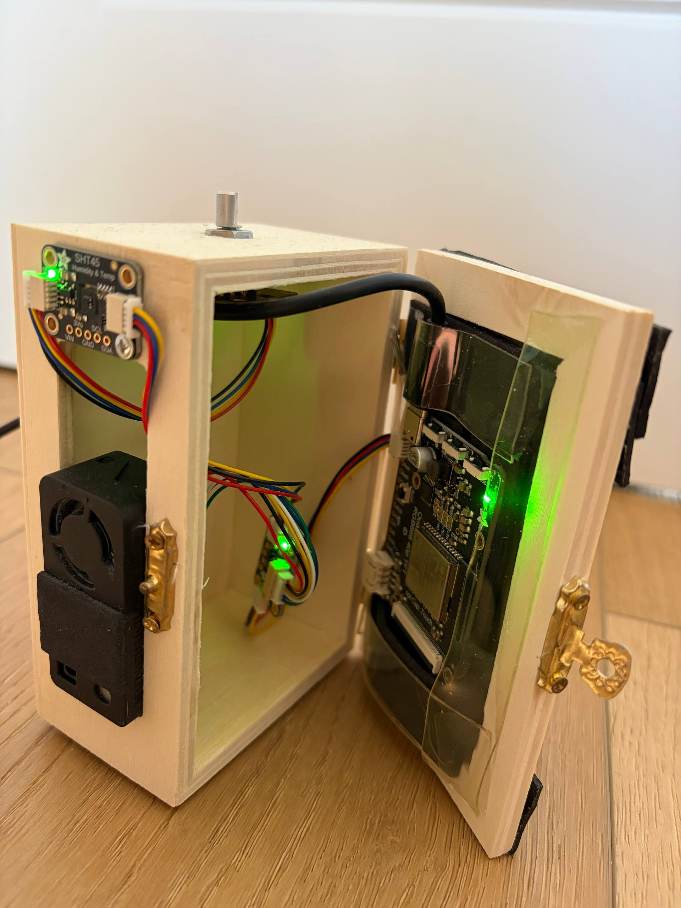
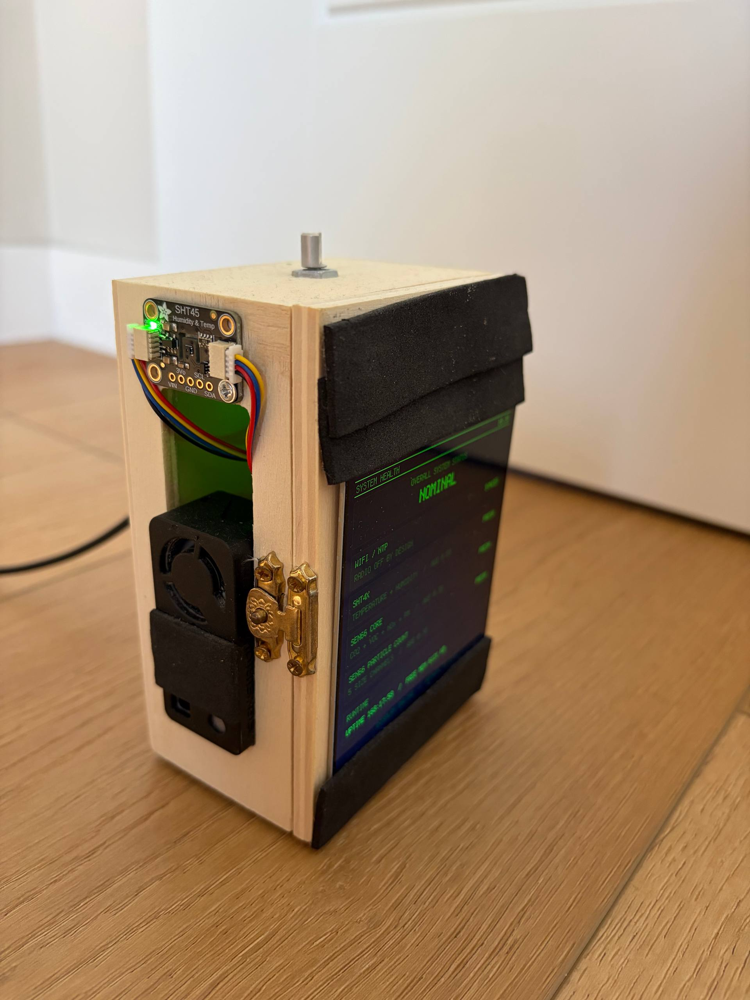
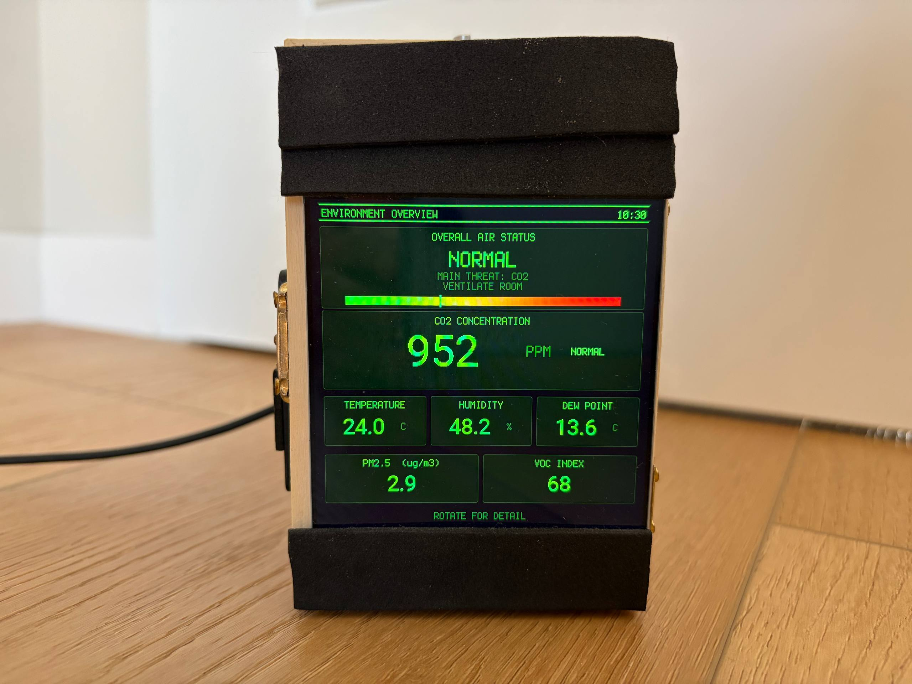
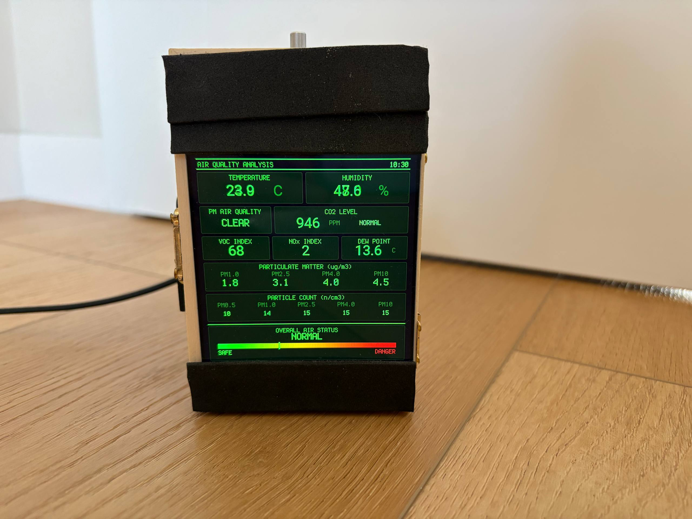
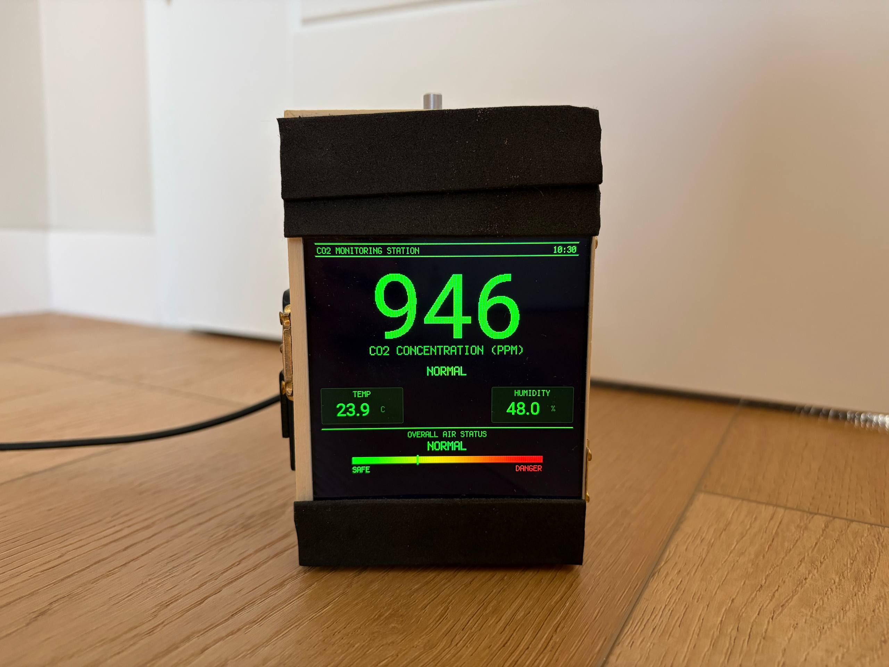
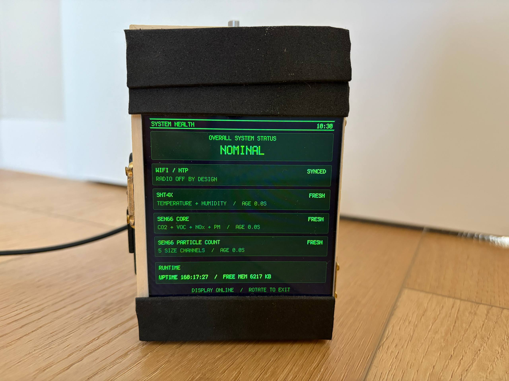

# AIR PRO specs

## Parts

| Part | Model | Job | I2C address |
|------|-------|-----|-------------|
| Main board | Adafruit Qualia ESP32-S3 for RGB666 displays | Runs CircuitPython, drives the display | |
| Display | 4 inch 720x720 square RGB666 TFT (with cap touch, touch not used) | Shows the UI | |
| Air sensor | Sensirion SEN66 | CO2, PM1.0/2.5/4.0/10, particle counts, VOC index, NOx index | 0x6B |
| Temp / humidity | Adafruit SHT45 breakout | Accurate temperature and humidity | 0x44 |
| Knob | Adafruit I2C QT Rotary Encoder (seesaw) | Rotate = next screen, press = night mode | 0x36 |
| IO expander | AW9523 (on the Qualia board) | Display backlight on/off | 0x3F |
| Cables | STEMMA QT / Qwiic JST SH 4 pin | All sensors on one I2C bus | |
| Power | USB-C cable | 5V from any USB charger | |
| Case | Small wooden box with brass hinges and latch, foam tape | Holds everything (temporary) | |

## Software

- CircuitPython 10.x, board `adafruit_qualia_s3_rgb666`
- Libraries in `lib/`: `adafruit_sen6x`, `adafruit_sht4x`, `adafruit_seesaw`,
  `adafruit_display_text`, `adafruit_display_shapes`, `adafruit_bitmap_font`, `adafruit_bus_device`
- Fonts in `fonts/`: Roboto 47 px and Roboto Clock 120 px (PCF)

## Numbers

| Item | Value |
|------|-------|
| Screen | 720 x 720 px, 12 MHz pixel clock |
| Sensor read interval | 2 s |
| Data counts as stale after | 10 s |
| Trend window | 120 s |
| NTP sync | every 1 h, retry every 5 min if it fails |
| WiFi | on only during NTP sync |

## Wiring

All parts share one I2C bus using STEMMA QT cables, daisy chained from the
STEMMA QT port on the Qualia board. Order does not matter, every part has its own address.

The display connects with the 40 pin flat cable to the Qualia board.

## Photos

### Inside

The case is open. Left wall: SHT45 at the top and SEN66 (black box with fan) at the bottom,
both mounted on the outside so they breathe room air. Top: rotary encoder shaft.
Right door: Qualia S3 board taped to the back of the display. Colored wires are the I2C cables.

### Side

Side view with the case closed. SHT45 and SEN66 sit outside the box, away from the warm board.
The brass latch keeps the door closed.

### Screen 1: Environment Overview

Main screen. Overall air status with a safe to danger bar, the main problem and advice,
big CO2 value, then temperature, humidity, dew point, PM2.5 and VOC.

### Screen 2: Air Quality Analysis

All readings on one page: temperature, humidity, PM air quality (EAQI), CO2, VOC, NOx,
dew point, PM mass for 4 sizes and particle counts for 5 sizes.

### Screen 3: CO2 Monitoring Station

Huge CO2 number that you can read from far away, plus temperature and humidity.

### Screen 4: System Health

Check that everything works: WiFi/NTP state, each sensor is FRESH or STALE and
how old the data is, uptime and free memory.

## Next step: 3D printed case

The wooden box works but it is a prototype. The display is held by foam tape and
the board is taped to the display.

Goals for the new case:

- Front frame that holds the 720x720 display, no foam tape
- Mounts (screws or clips) for the Qualia board behind the display
- Sensor bay for SEN66 and SHT45 with air vents, separated from the board so heat
  from the ESP32 and backlight does not change the readings
- Clear air path for the SEN66 fan: inlet and outlet must not be blocked
- Hole on top for the rotary encoder, with a real knob cap
- USB-C cutout for power and for editing code
- Easy to open for flashing and debugging
- Stand or feet so it sits at a slight angle on a desk

To do before modeling:

- [ ] Measure all boards and the display (or take them from Adafruit / Sensirion CAD files)
- [ ] Pick a cable routing and mounting order
- [ ] First print, then check temperature offset vs the wooden box